# 🚀 Запуск проекта

### 1. Клонировать репозиторий
```bash   
git clone https://github.com/MaksimovDenis/PVZ.git
```   
### 2. Перейти в директорию проекта (если Вы не в ней).  
```bash  
cd PVZ 
```  
### 3. Из дериктории проекта выполнить команды, сервис HTTP будет доступен по порту 8080, gRPC по порту 3000:  
```bash      
docker compose up --build 
```   

### 4. Остановка  
```bash      
docker compose down
```   
# 🛠Реализация  
- Подход с чистой архитектурой (сервис разбит на DLA, BLL и API слои).  
- Язык программирование: Golang 1.22.12  
- Для реализации http сервера использовалась библиотека gin  
- Кодогенерация oapi-codegen  
- База данных: PostgreSQL:latest
- В качестве билдера sql применялся squirrel 
- Логер zerolog   

# ✅ Условия  
1. Использовался приложенный к ТЗ API, без изменений: https://github.com/MaksimovDenis/PVZ/blob/master/pvz_http/pkg/protocol/schema.yml ✅    
2. Реализованы все ендпоинты указанные в задании (примеры см. ниже) ✅    
3. Сервер должен быть запущен на порту 8080. ✅   
4. Реализованы методы /login /register /dummyLogin ✅   
5. Ответы сервиса не превышают 100мс ✅   
6. Покрытие кода тестами 75% (большая часть функций, которую можно было покрыть юнит тестами - покрыта. Моки не писал) ❎
7. Интеграционный тест согласно условию - https://github.com/MaksimovDenis/PVZ/blob/master/pvz_http/internal/service/pvz_serive_integration_test.go   

# 🔧Дополнительные задания
1. Пользовательская авторизация по методам /register и /login - реализована ✅    
2. Реализован gRPC сервис доступный по порту 3000 ✅   
3. В проект добавлен prometheus, доступны следующие метрики:
    - **http_request_total** (общее количество http риквестов)   
    - **http_request_duration_seconds** (гистограмма времени ответа)    
    - **http_requests_duration_seconds_summary** (latency ответа)   
    - **pvz_count_total** (общее количество созданных ПВЗ)   
    - **reception_count_total** (общее количество созданных приёмок)   
    - **products_count_total**  (общее количество добавленных продуктов)   
 Сервер для prometheus поднят на порту 9000 и доступен по ручке /metrics. ✅   
 4. Логирование zerolog ✅   
 5. Реализована кодогенерация DTO endpoint'ов по openapi схеме https://github.com/MaksimovDenis/PVZ/tree/master/pvz_http/pkg/protocol ✅   

# 🧑‍💻Некоторые примеры запросов 
 - Эндпоинт (Регистрация пользователя №1, №2): **POST /register** **POST /dummyLogin**  
   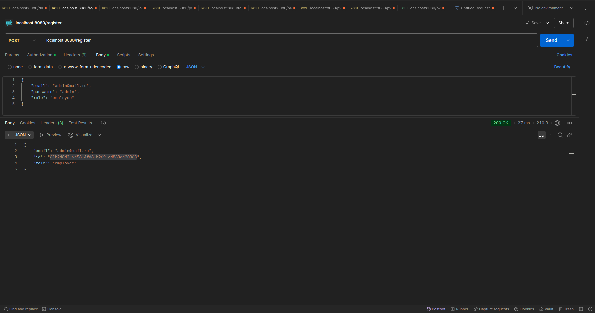  
   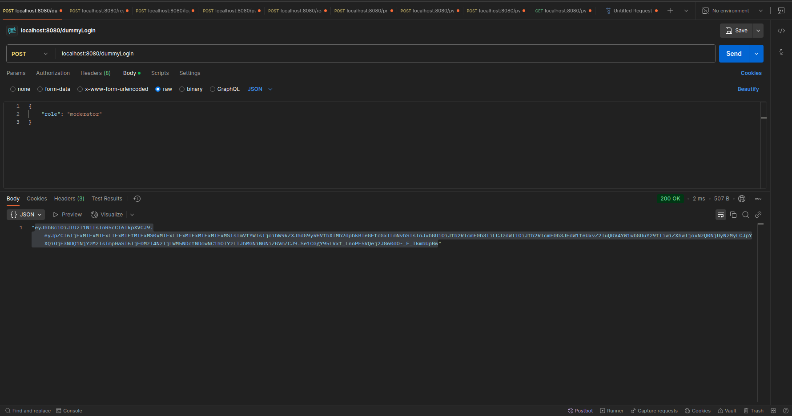  
 - Эндпоинт (Авторизация пользователей по почте и паролю №3, №4): **POST /login**  
   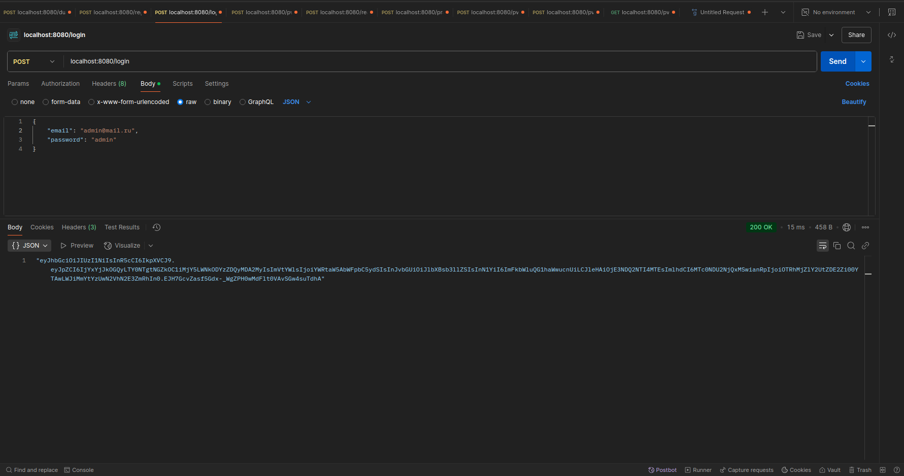  
   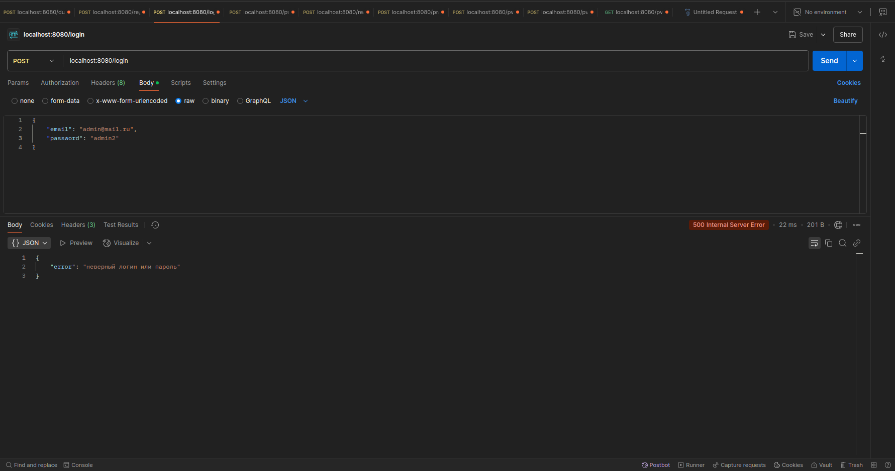  
 - Эндпоинт (Заведение ПВЗ №5, №6): **POST /pvz**  
   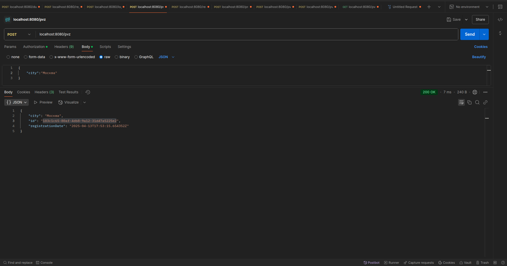  
   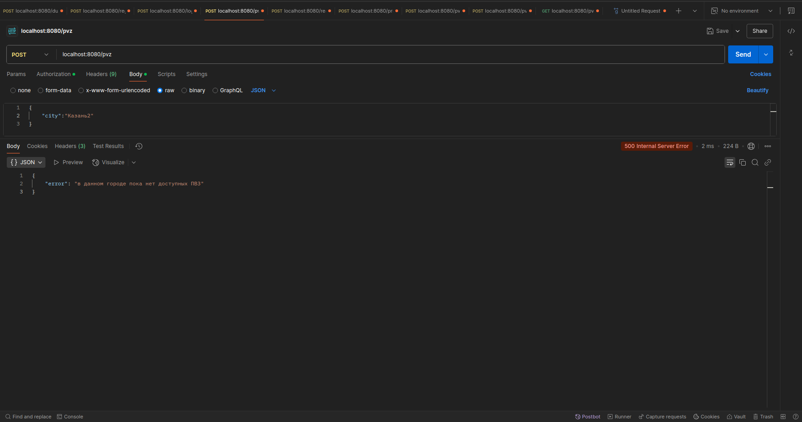 
 - Эндпоинт (Добавление информации о приёмке товаров №7, №8): **POST /receptions**  
   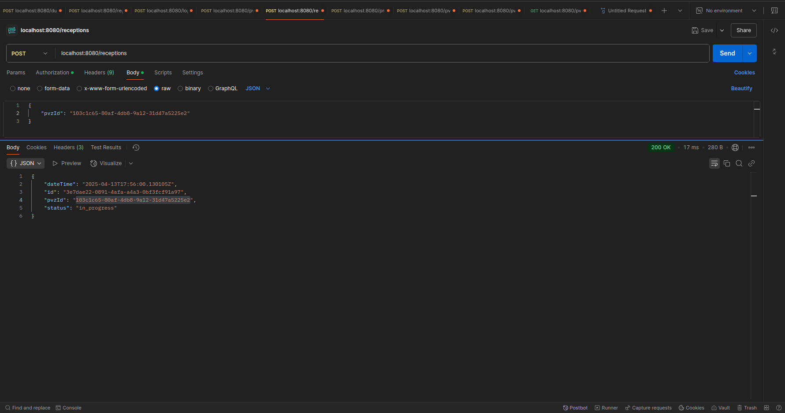  
   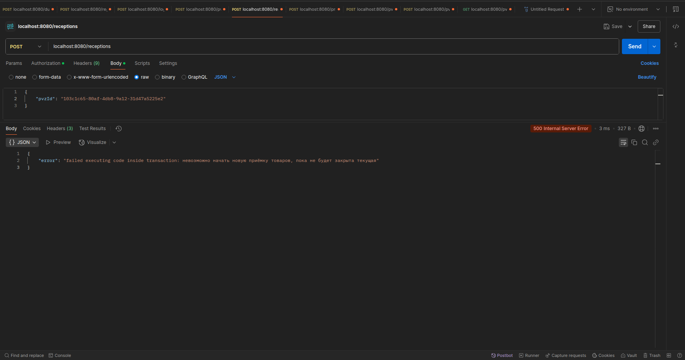  
 - Эндпоинт (Добавление товаров в рамках одной приёмки №9, №10, №11): **POST /products**  
   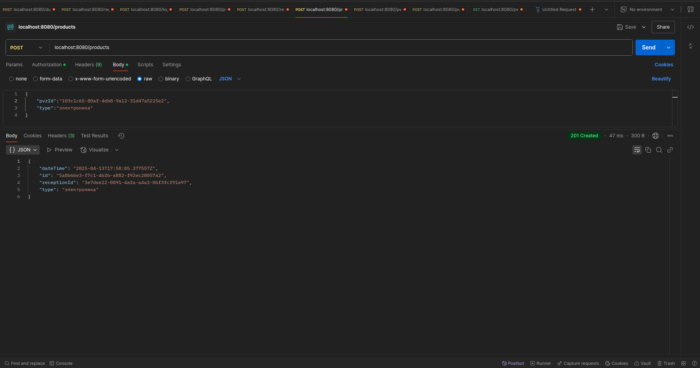  
   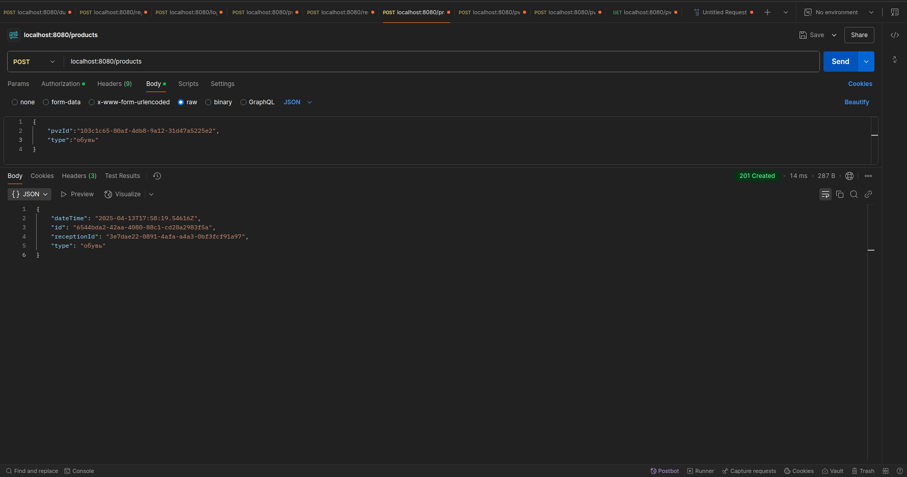 
   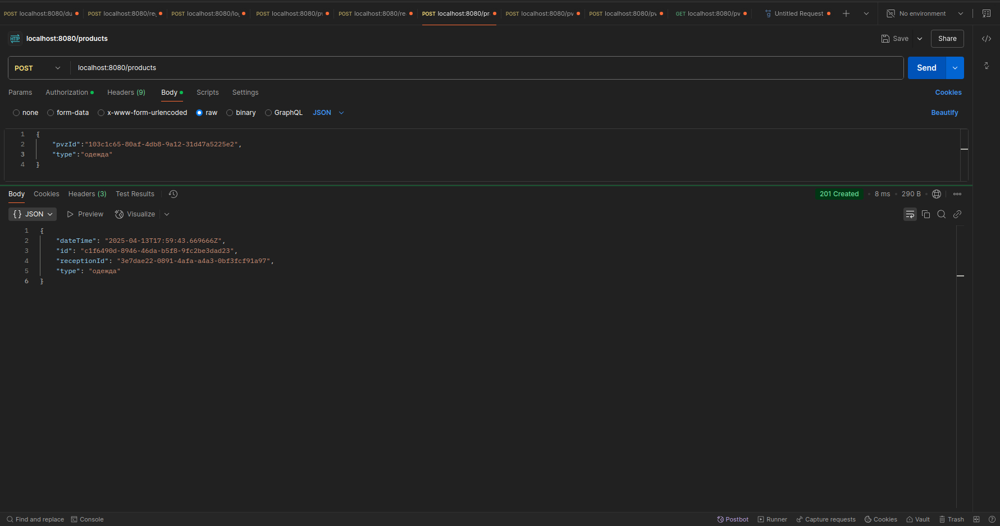 
 - Эндпоинт (Удаление товаров в рамках не закрытой приёмки №12): **POST /pvz/{pvzId}/delete_last_product**  
   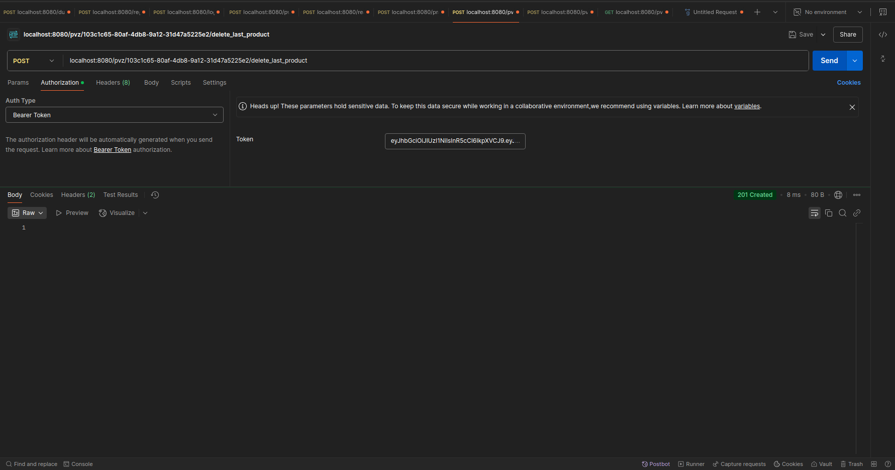  
 - Эндпоинт (Закрытие приёмки №13, №14, №15): **POST /pvz/{pvzId}/close_last_reception**  
   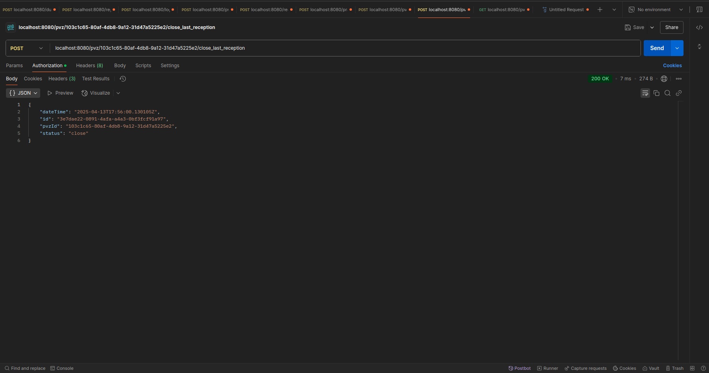  
   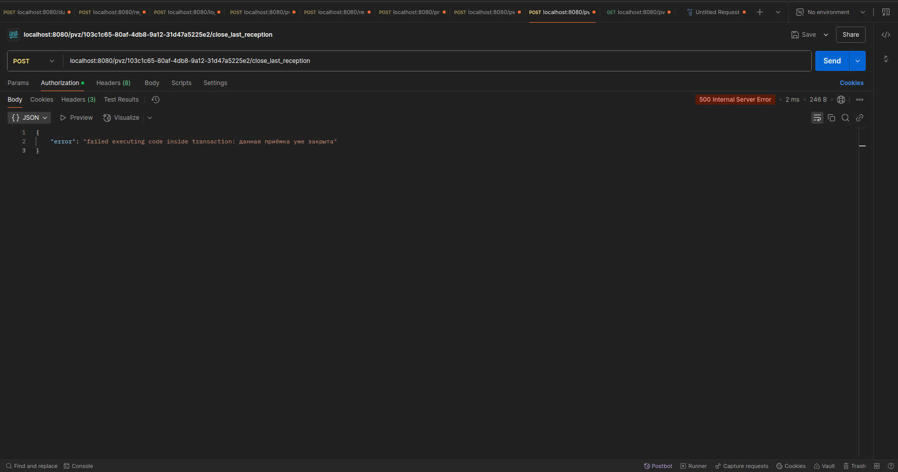  
   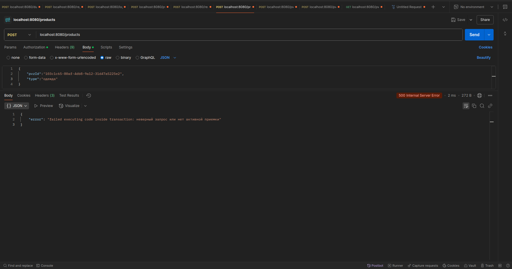  
 - Эндпоинт (Получение данных №16): **GET /pvz**  
   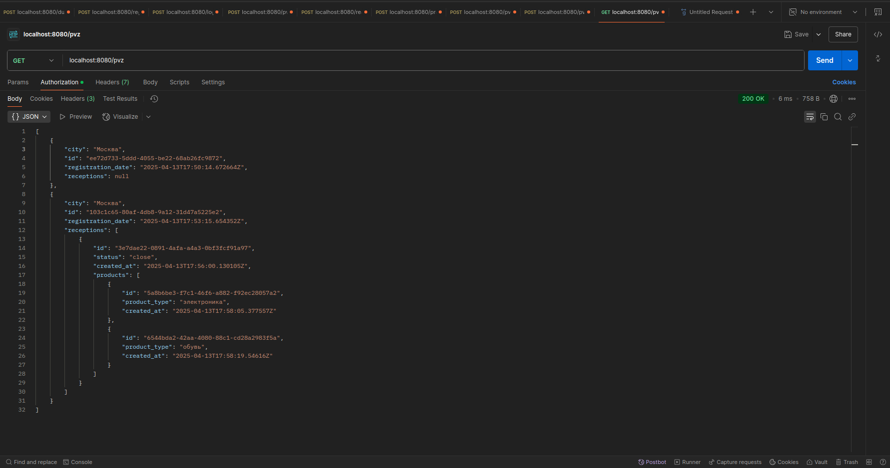  
 - gRPC Эндпоинт (Получение данных №17): **gRPC**  
   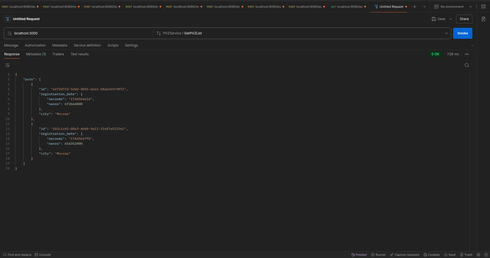  

 # 🚧 Ход решения
 - Как таковых проблем не возникло, в бизнес слое описаны комментарии с логикой работы.   

 # 🚧 Что следует улучшить  
- Стоит улучшить систему валидации полей, основные сценарии учтены, но не все.  
- Необходимо улучшить систему обработки всех возможных ошибок.  
- Дополнить код большим количеством тестов.  
- Дополнить сервис системой кеширования, например, через Redis, по патерну Singleton.
- Хорошо будет добавить полноценную систему авторизации и аутентификации с refresh и access токенами.  